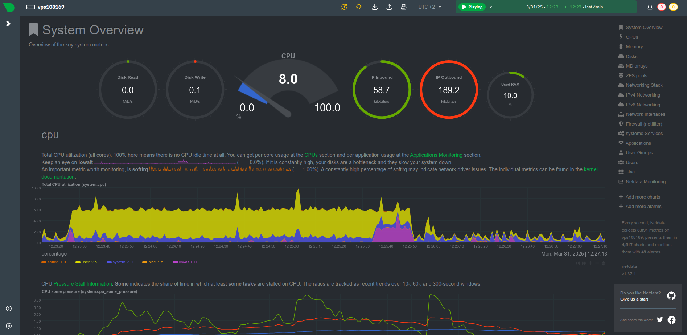

# Documentation du VPS

## Introduction
Cette documentation détaille la configuration et la maintenance d'un serveur VPS (Virtual Private Server) sous Linux. Elle couvre l'ensemble des outils installés, leur configuration, et les bonnes pratiques de sécurité et de maintenance mises en place. Ce guide est conçu pour être à la fois une référence technique et un manuel d'utilisation quotidienne.

## Table des matières
1. [Mise à jour et configuration initiale du système](#1-mise-à-jour-et-configuration-initiale-du-système)
   - [1.1 Mise à jour du système](#11-mise-à-jour-du-système)

2. [Sécurisation](#2-sécurisation)
   - [2.1 UFW (Uncomplicated Firewall)](#21-ufw-uncomplicated-firewall)
   - [2.2 Fail2Ban](#22-fail2ban)

3. [Surveillance système](#3-surveillance-système)
   - [3.1 Netdata](#31-netdata)
   - [3.2 htop](#32-htop)
   - [3.3 ncdu](#33-ncdu)

4. [Outils d'administration et de scripting](#4-outils-dadministration-et-de-scripting)
   - [4.1 Git](#41-git)
   - [4.2 Zsh](#42-zsh-shell-alternatif)
   - [4.3 Oh-My-Zsh](#43-oh-my-zsh)

5. [Serveur Web et Sécurité HTTPS](#5-serveur-web-et-sécurité-https)
   - [5.1 Nginx](#51-nginx)
   - [5.2 Certbot (Let's Encrypt)](#52-certbot-lets-encrypt)

6. [Test de charge](#6-test-de-charge)
   - [6.1 Apache Benchmark (ab)](#61-apache-benchmark-ab)
   - [6.2 Résultats du test de charge](#62-résultats-du-test-de-charge)

7. [Maintenance & Sauvegarde](#7-maintenance--sauvegarde)
   - [7.1 Script de sauvegarde automatique](#71-script-de-sauvegarde-automatique)
   - [7.2 Automatisation avec Cron](#72-automatisation-avec-cron)

Ce fichier contient la documentation sur les outils installés et utilisés sur ce VPS, ainsi que des informations sur leur rôle et les commandes d'utilisation typiques.

## 1. Mise à jour et configuration initiale du système

### 1.1 Mise à jour du système
- **Commande d'installation** :
  ```bash
  sudo apt update && sudo apt upgrade -y
  ```
- **Rôle** : Met à jour le système pour s'assurer que tous les paquets sont à jour.
- **Commande d'utilisation typique** :
  ```bash
  sudo apt update
  sudo apt upgrade
  ```

## 2. Sécurisation

### 2.1 UFW (Uncomplicated Firewall)
- **Commande d'installation** :
  ```bash
  sudo apt install ufw
  ```
- **Rôle** : Configure le pare-feu pour protéger le serveur en autorisant uniquement les connexions nécessaires (SSH, HTTP, HTTPS).
- **Commande d'utilisation typique** :
  - Activer le pare-feu :
    ```bash
    sudo ufw enable
    ```
  - Vérifier l'état du pare-feu :
    ```bash
    sudo ufw status
    ```

### 2.2 Fail2Ban
- **Commande d'installation** :
  ```bash
  sudo apt install fail2ban
  ```
- **Rôle** : Protège contre les attaques par force brute en bloquant les IP qui tentent de se connecter de manière répétée avec des identifiants incorrects.
- **Commande d'utilisation typique** :
  - Démarrer Fail2Ban :
    ```bash
    sudo systemctl start fail2ban
    ```
  - Vérifier le statut :
    ```bash
    sudo systemctl status fail2ban
    ```

## 3. Surveillance système

### 3.1 Netdata
- **Commande d'installation** :
  ```bash
  bash <(curl -Ss https://get-netdata.io)
  ```
- **Rôle** : Permet de surveiller les performances du serveur en temps réel (CPU, RAM, disque, réseau, etc.). Netdata fournit une vue détaillée de l'état de votre serveur avec une interface graphique interactive.
- **Interface de monitoring** :
  
- **Commande d'utilisation typique** :
  - Accéder à l'interface web de Netdata :
    ```url
    http://213.156.132.122:12000/
    ```
- **Configuration des alertes** :
  - Alerte d'espace disque configurée :
    ```bash
    sudo nano /etc/netdata/health.d/disk_space.conf
    ```
    ```
    disk_space:
      enabled: yes
      critical: 80
      warning: 70
    ```
    Cette configuration déclenche une alerte d'avertissement lorsque l'utilisation du disque atteint 70% et une alerte critique à 80%.

### 3.2 htop
- **Commande d'installation** :
  ```bash
  sudo apt install htop
  ```
- **Rôle** : Outil interactif pour surveiller les processus du système en temps réel.
- **Commande d'utilisation typique** :
  ```bash
  htop
  ```

### 3.3 ncdu
- **Commande d'installation** :
  ```bash
  sudo apt install ncdu
  ```
- **Rôle** : Outil pour analyser l'utilisation du disque de manière interactive.
- **Commande d'utilisation typique** :
  ```bash
  ncdu
  ```

## 4. Outils d'administration et de scripting

### 4.1 Git
- **Commande d'installation** :
  ```bash
  sudo apt install git
  ```
- **Rôle** : Gestionnaire de versions pour le suivi des modifications du code source et des documents.
- **Commande d'utilisation typique** :
  - Cloner un repository :
    ```bash
    git clone <url_du_repository>
    ```
  - Committer des changements :
    ```bash
    git add .
    git commit -m "Message de commit"
    git push
    ```

### 4.2 Zsh (Shell alternatif)
- **Commande d'installation** :
  ```bash
  sudo apt install zsh
  ```
- **Rôle** : Un shell amélioré par rapport à Bash, avec plus de fonctionnalités interactives.
- **Commande d'utilisation typique** :
  - Lancer Zsh :
    ```bash
    zsh
    ```

### 4.3 Oh-My-Zsh
- **Commande d'installation** :
  ```bash
  sh -c "$(curl -fsSL https://raw.githubusercontent.com/ohmyzsh/ohmyzsh/master/tools/install.sh)"
  ```
- **Rôle** : Framework pour gérer la configuration de Zsh, avec de nombreux plugins et thèmes.
- **Commande d'utilisation typique** :
  - Changer de thème :
    ```bash
    ZSH_THEME="agnoster"
    ```

## 5. Serveur Web et Sécurité HTTPS

### 5.1 Nginx
- **Commande d'installation** :
  ```bash
  sudo apt install nginx
  ```
- **Rôle** : Serveur web performant qui peut également servir de proxy inverse, d'équilibreur de charge et de cache HTTP.
- **Commande d'utilisation typique** :
  - Démarrer Nginx :
    ```bash
    sudo systemctl start nginx
    ```
  - Vérifier le statut :
    ```bash
    sudo systemctl status nginx
    ```
  - Redémarrer après modification de configuration :
    ```bash
    sudo systemctl restart nginx
    ```
- **Configuration de base** :
  - Créer un fichier de configuration pour votre site :
    ```bash
    sudo nano /etc/nginx/sites-available/votre-domaine.conf
    ```
  - Contenu de base pour la configuration :
    ```nginx
    server {
        listen 80;
        server_name milan.hommet.caen.mds-project.fr;
        
        root /var/www/html;
        index index.html;

        location / {
            try_files $uri $uri/ =404;
        }
    }
    ```
  - Activer la configuration :
    ```bash
    sudo ln -s /etc/nginx/sites-available/votre-domaine.conf /etc/nginx/sites-enabled/
    sudo rm /etc/nginx/sites-enabled/default  # Supprime la configuration par défaut
    sudo nginx -t  # Teste la configuration
    sudo systemctl restart nginx
    ```

### 5.2 Certbot (Let's Encrypt)
- **Commande d'installation** :
  ```bash
  sudo apt install certbot python3-certbot-nginx
  ```
- **Rôle** : Outil pour obtenir et renouveler automatiquement des certificats SSL/TLS gratuits de Let's Encrypt afin de sécuriser le site web avec HTTPS.
- **Commande d'utilisation typique** :
  - Obtenir un certificat et configurer Nginx :
    ```bash
    sudo certbot --nginx -d votre-domaine.com
    ```
  - Renouveler manuellement tous les certificats :
    ```bash
    sudo certbot renew
    ```
- **Note** : Le domaine a été validé avec succès via Certbot, permettant ainsi une connexion HTTPS sécurisée.

## 6. Test de charge

### 6.1 Apache Benchmark (ab)
- **Commande d'installation** :
  ```bash
  sudo apt install apache2-utils
  ```
- **Rôle** : Outil de test de charge pour mesurer les performances d'un serveur web.
- **Commande d'utilisation typique** :
  ```bash
  ab -n 1000 -c 10 https://votre-domaine.com/
  ```
  Cette commande simule 1000 requêtes avec 10 utilisateurs simultanés.

### 6.2 Résultats du test de charge
- **Temps de réponse** : X ms (temps moyen par requête)
- **Débit** : Y requêtes/seconde
- **Détails supplémentaires** :
  ```
  Concurrency Level:      10
  Time taken for tests:   X seconds
  Complete requests:      1000
  Failed requests:        0
  Requests per second:    Y [#/sec] (mean)
  Time per request:       Z [ms] (mean)
  Transfer rate:          W [Kbytes/sec] received
  ```

## 7. Maintenance & Sauvegarde

### 7.1 Script de sauvegarde automatique
- **Emplacement du script** : `/usr/local/bin/backup.sh`
- **Rôle** : Sauvegarde les répertoires critiques du système et les compresse dans une archive datée.
- **Contenu du script** :
  ```bash
  #!/bin/bash

  # Définir la date pour le nom du fichier
  DATE=$(date +%Y-%m-%d_%H-%M-%S)

  # Définir le répertoire de sauvegarde
  BACKUP_DIR="/home/backup"

  # Créer le répertoire de sauvegarde s'il n'existe pas
  mkdir -p $BACKUP_DIR

  # Créer l'archive
  tar -czf $BACKUP_DIR/backup_$DATE.tar.gz /etc /var/log /home/$(whoami) --exclude=$BACKUP_DIR

  # Supprimer les sauvegardes de plus de 7 jours
  find $BACKUP_DIR -name "backup_*.tar.gz" -type f -mtime +7 -delete

  echo "Sauvegarde terminée: $BACKUP_DIR/backup_$DATE.tar.gz"
  ```

### 7.2 Automatisation avec Cron
- **Configuration** : Exécution toutes les 6 heures
- **Commande d'installation** :
  ```bash
  sudo crontab -e
  ```
  Puis ajout de la ligne :
  ```
  0 */6 * * * /usr/local/bin/backup.sh
  ```
- **Rôle** : Planifie l'exécution automatique du script de sauvegarde.
- **Emplacement des sauvegardes** : `/home/backup/backup_DATE.tar.gz`
- **Politique de rétention** : Les sauvegardes de plus de 7 jours sont automatiquement supprimées.

